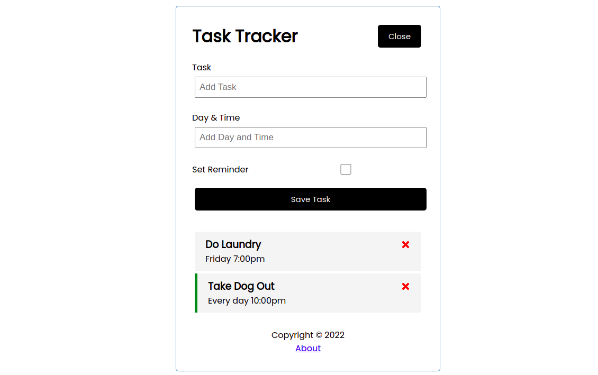

# Task Tracker 

> A Single Page App (SPA) following Brad Traversy React Crash Course that make use of create-react-app and react router and allows users to:

* Keep track of shores
* Set reminder for upcoming tasks
* Use React components

Checkout Brad's video tutorial [here](https://www.youtube.com/watch?v=w7ejDZ8SWv8&ab_channel=TraversyMedia)

## Built With

- Javascript
- HTML&CSS
- create-react-app
- React Router
- React Testing Library 
- JSON-server

## Getting Started

To get a local copy up and running follow these simple example steps.

### Prerequisites

- Code Editor
- Git installed
- Node js installed 

### Setup

- To clone the repository run `git clone` in your terminal
- Next run `npm install` to install dependances
- To run the project run `npm start` this will open your web browser on localhost:8080

## Authors

👤 **Author**

- GitHub: [@jr-cast](https://github.com/jr-cast)
- Twitter: [@josercastanos](https://twitter.com/josercastanos)
- LinkedIn: [@jr-cast](https://linkedin.com/in/jr-cast)

## 🤝 Contributing

Contributions, issues, and feature requests are welcome!

Feel free to check the [issues page](../../issues/).

## Show your support

Give a ⭐️ if you like this project!

## Acknowledgments

- Brad Traversy for the video tutorial
- Hat tip to anyone whose code was used

## 📝 License

This project is [MIT](./LICENSE) licensed.
